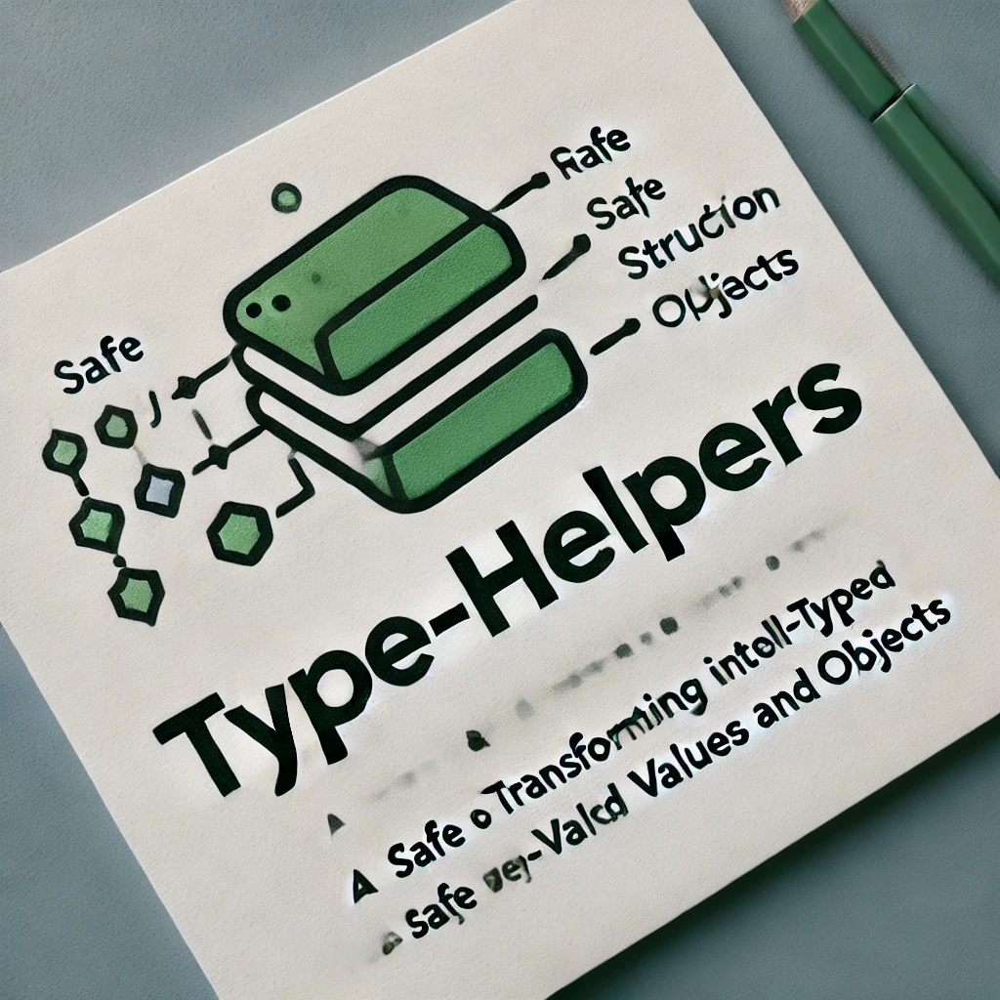

Utilities for transforming raw input into safe and well-typed values and
objects.

<p align="center">
<a href="https://github.com/vbarbarosh/type-helpers/actions"></a>
<a href="https://opensource.org/licenses/MIT" rel="nofollow"></a>
<a href="https://www.npmjs.com/package/@vbarbarosh/type-helpers" rel="nofollow"></a>
<a href="https://github.com/vbarbarosh/type-helpers" rel="nofollow"></a>
</p>

<p align="center">

</p>

## Installation

```
npm install @vbarbarosh/type-helpers
```

## Basic usage

Creating basic types:

```js
const assert = require('assert');
const make = require('@vbarbarosh/type-helpers/src/make');

assert.strictEqual(make('int'), 0);
assert.strictEqual(make('int', -0), 0);
assert.strictEqual(make('int', '15.55'), 15);
assert.strictEqual(make('int', '15.999'), 15);

assert.strictEqual(make('float'), 0);
assert.strictEqual(make('float', -0), 0);
assert.strictEqual(make('float', '15.55'), 15.55);
assert.strictEqual(make('float', '15.999'), 15.999);

assert.strictEqual(make('bool', ''), false);
assert.strictEqual(make('bool', '1'), true);
assert.strictEqual(make('bool', 'x'), true);

assert.strictEqual(make('string', 1), '1');
assert.strictEqual(make('string', true), 'true');
assert.strictEqual(make('string', false), 'false');
```

Creating enum:

```js
const assert = require('assert');
const make = require('@vbarbarosh/type-helpers/src/make');

assert.strictEqual(make({type: 'enum', options: ['foo', 'bar', 'baz']}), 'foo');
assert.strictEqual(make({type: 'enum', options: ['foo', 'bar', 'baz']}, 'x'), 'foo');
assert.strictEqual(make({type: 'enum', options: ['foo', 'bar', 'baz']}, 'bar'), 'bar');
```

Creating uniform arrays (all values have the same type):

```js
const assert = require('assert');
const make = require('@vbarbarosh/type-helpers/src/make');

assert.deepStrictEqual(make({type: 'array', of: 'string'}), []);
assert.deepStrictEqual(make({type: 'array', of: 'string', min: 2}, 'x'), ['x', '']);
assert.deepStrictEqual(make({type: 'array', of: 'int', min: 2}, ['1']), [1, 0]);
```

Creating tuples (an array with fixed number of elements and predefined types):

```js
const assert = require('assert');
const make = require('@vbarbarosh/type-helpers/src/make');

assert.deepStrictEqual(make({type: 'tuple', items: ['string', 'string']}), ['', '']);
assert.deepStrictEqual(make({type: 'tuple', items: ['string', 'string']}, ['a']), ['a', '']);
```

Creating objects:

```js
const assert = require('assert');
const make = require('@vbarbarosh/type-helpers/src/make');

const types = {
    rect: {
        width: {type: 'int', min: 0},
        height: {type: 'int', min: 0},
    },
};

assert.deepStrictEqual(make('rect', null, types), {width: 0, height: 0});
assert.deepStrictEqual(make('rect', {}, types), {width: 0, height: 0});
assert.deepStrictEqual(make('rect', {width: -100}, types), {width: 0, height: 0});
assert.deepStrictEqual(make('rect', {width: 15, height: 25}, types), {width: 15, height: 25});
```

Creating object unions (an object which shape is determined by value from a property):

```js
const assert = require('assert');
const make = require('@vbarbarosh/type-helpers/src/make');

const types = {
    widget: {
        type: 'union',
        prop: 'kind',
        default: 'text',
        options: {
            text: {
                value: 'string',
            },
            number: {
                value: 'float',
                min: 'float',
                max: 'float',
                step: {type: 'float', min: 0.001, default: 1},
            },
            submit: {
                label: 'string',
                name: 'string',
                value: 'string',
            },
        },
    },
};

assert.deepStrictEqual(make('widget', null, types), {kind: 'text', value: ''});
assert.deepStrictEqual(make('widget', {kind: 'submit'}, types), {kind: 'submit', label: '', name: '', value: ''});
```

## Related

### Reading

* https://medium.com/hoppinger/type-driven-development-for-single-page-applications-bf8ee98d48e2
* https://medium.com/flow-type/types-first-a-scalable-new-architecture-for-flow-3d8c7ba1d4eb

### Tools

* https://zod.dev/
* https://www.npmjs.com/package/schema-object
* https://www.npmjs.com/package/@humanwhocodes/object-schema
* https://www.npmjs.com/package/@eslint/object-schema
* https://json-schema.org
* https://domsignal.com/json-schema-generator
* https://github.com/sourcemeta/awesome-jsonschema
* https://github.com/jquense/yup
* https://github.com/gcanti/io-ts
* https://github.com/typestack/class-transformer
* https://valibot.dev/blog/valibot-v1-the-1-kb-schema-library/
