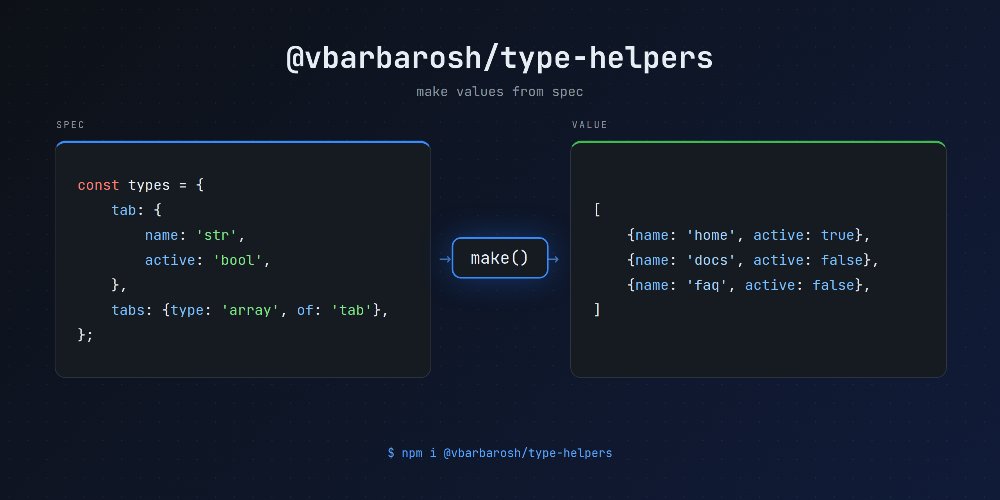

Utilities for transforming raw input into safe and well-typed values and
objects.

<p align="center">
<a href="https://github.com/vbarbarosh/type-helpers/actions"></a>
<a href="https://opensource.org/licenses/MIT" rel="nofollow"></a>
<a href="https://www.npmjs.com/package/@vbarbarosh/type-helpers" rel="nofollow"></a>
<a href="https://github.com/vbarbarosh/type-helpers" rel="nofollow"></a>
</p>

<p align="center">

</p>

## 💾 Installation

```
npm install @vbarbarosh/type-helpers
```

## 🎯 Motivation

1. Generate well-typed objects initialized from an untrusted source
2. Collect a set of functions for checking types in JavaScript
3. Edge values: a list of tricky JavaScript values which every function
   should be checked against (see [Edge values](#-edge-values))

```js
const make = require('@vbarbarosh/type-helpers');

const types = {
    tab: {
        name: 'str',
        label: 'str',
        active: 'bool',
        disabled: 'bool',
    },
    tabs: {type: 'array', of: 'tab'},
};

// body came from a request, query params, localStorage — anything untrusted
const tabs = make(body?.card, 'tabs', types);
// ✅ an array of well-formed tab objects, no matter what body was
```

## ✨ Basic usage

`make(input, expr, types)` converts any input into a value described by `expr`:

```js
const assert = require('assert');
const make = require('@vbarbarosh/type-helpers');

assert.strictEqual(make('15.55', 'int'), 15);
assert.strictEqual(make('15.55', 'float'), 15.55);
assert.strictEqual(make(150, {type: 'int', min: 0, max: 100}), 100);
assert.strictEqual(make('abc', 'int'), 0);
assert.strictEqual(make(null, {type: 'int', default: 25}), 25);

assert.strictEqual(make('', 'bool'), false);
assert.strictEqual(make('x', 'bool'), true);

assert.strictEqual(make(1, 'str'), '1');
assert.strictEqual(make(false, 'str'), 'false');
assert.strictEqual(make({}, 'str'), ''); // objects never leak into strings

assert.deepStrictEqual(make(null, 'rect', {rect: {w: 'int', h: 'int'}}), {w: 0, h: 0});
```

The same idea scales from a single value to deeply nested structures: whatever
garbage comes in, a value of the requested shape comes out.

## 🧬 Expressions

In general, an expression is an object with the following **reserved**
properties:

| Name       | Type                    | Description                                                                                                            |
|------------|-------------------------|------------------------------------------------------------------------------------------------------------------------|
| `type`     | `string`<br/>`function` | Either the name of a built-in or user-defined type, or a function with 3 arguments: `function (input, params, types)`. |
| `nullable` | `boolean`               | If it evaluates to `true`, then the value could be `null`.                                                             |
| `before`   | `function`              | A preprocessor for input data: `before(input)`.                                                                        |
| `after`    | `function`              | A postprocessor for output data: `after(out)`.                                                                        |

Depending on the type, an expression might have more properties. For example,
`{type: 'int'}` expects `min`, `max`, and `default`, while `{type: 'enum'}`
expects an `options` array.

As syntactic sugar, the expression could be a `string`, a `function`, or an
`object` without the **reserved** property `type`. In that case, it is treated
as `{type: expr}`.

| Type       | Example                                                                                              |
|------------|------------------------------------------------------------------------------------------------------|
| `string`   | `make(input, 'int')` →<br/>`make(input, {type: 'int'})`                                              |
| `function` | ``make(input, v => `[${v}]`)`` →<br/>``make(input, {type: v => `[${v}]`})``                          |
| `object`   | `make(input, {w: 'int', h: 'int'})` →<br/>`make(input, {type: 'obj', props: {w: 'int', h: 'int'}})` |

### nullable

When **nullable** evaluates to `true`, `make` returns `null` immediately when
**input** is either `null` or `undefined`; `before`, conversion, and `after`
are not called. For non-nullish input, `before` runs normally. If it returns
`null` or `undefined`, `make` also returns `null` without conversion or
`after`.

```js
assert.strictEqual(make(null, {type: 'int', nullable: true}), null);
assert.strictEqual(make(undefined, {type: 'str', nullable: true}), null);
assert.strictEqual(make('', {type: 'int', nullable: true, before: v => v === '' ? null : v}), null);
assert.strictEqual(make(NaN, {type: 'int', nullable: true}), 0); // ⚠️ NaN is not null/undefined
```

### before, after

`before(input)` preprocesses the input before conversion, `after(out)`
postprocesses the converted result. A typical use for `after` is enforcing
invariants between properties:

```js
const border = {
    type: 'obj',
    props: {
        style: {type: 'enum', options: ['none', 'solid', 'dashed']},
        size: {type: 'int', min: 0, max: 100, default: 1},
    },
    // a border with no style has no size
    after: out => (out.style === 'none' ? {...out, size: 0} : out),
};

assert.deepStrictEqual(make({size: 5}, border), {style: 'none', size: 0});
assert.deepStrictEqual(make({size: 5, style: 'solid'}, border), {style: 'solid', size: 5});
```

### 🩼 Escape hatch

To describe an object which has its own `type` property, wrap the property
value into an array:

```js
assert.deepStrictEqual(
    make(null, {type: ['str'], width: 'int'}),
    {type: '', width: 0});
```

## 📦 Built-in types

### raw

```js
{type: 'raw', nullable: false, before: input => input, after: out => out}
```

Returns input untouched.

```js
assert.strictEqual(make('ggg', 'raw'), 'ggg');
assert.strictEqual(make(undefined, 'raw'), undefined);
```

### any

```js
{type: 'any', default: undefined, nullable: false, before: input => input, after: out => out}
```

Returns input unless it is `undefined`, in which case returns `default`.

```js
assert.strictEqual(make(null, 'any'), null);
assert.strictEqual(make(undefined, {type: 'any', default: 5}), 5);
```

### null

```js
{type: 'null', nullable: false, before: input => input, after: out => out}
```

Always returns `null`, discarding any input. A shorthand for
`{type: 'const', value: null}`.

### const

```js
{type: 'const', value: 123, nullable: false, before: input => input, after: out => out}
```

Always returns `value`, discarding any input.

```js
const types = {apple: {type: 'const', value: 'apple'}};
assert.strictEqual(make('ggg', 'apple', types), 'apple');
```

### bool

```js
{type: 'bool', default: false, nullable: false, before: input => input, after: out => out}
```

Truthy input makes `true`, falsy input makes `false`; `null`, `undefined`,
and `NaN` make `default`.

```js
assert.strictEqual(make('', 'bool'), false);
assert.strictEqual(make('x', 'bool'), true);
assert.strictEqual(make(0, 'bool'), false);
assert.strictEqual(make(null, {type: 'bool', default: true}), true);
```

### int

```js
{type: 'int', min: 0, max: 100, default: 0, nullable: false, before: input => input, after: out => out}
```

Numbers and numeric strings are truncated toward zero and clamped into
`[min, max]`. Everything else makes `default` (clamped as well).

```js
assert.strictEqual(make('15.999', 'int'), 15);
assert.strictEqual(make(150, {type: 'int', min: 0, max: 100}), 100);
assert.strictEqual(make('abc', {type: 'int', min: 10, max: 100}), 10);
assert.strictEqual(make(-0, 'int'), 0);
```

### float

```js
{type: 'float', min: 0, max: 100, default: 0, nullable: false, before: input => input, after: out => out}
```

Same as `int`, but without truncation.

```js
assert.strictEqual(make('15.55', 'float'), 15.55);
assert.strictEqual(make('1e3', {type: 'float', max: 100}), 100);
```

### str

```js
{type: 'str', default: 'foo', nullable: false, before: input => input, after: out => out}
```

Strings are returned as is; numbers, booleans, and bigints are stringified;
everything else makes `default` — objects and arrays never leak into strings
via implicit coercion.

```js
assert.strictEqual(make(15.55, 'str'), '15.55');
assert.strictEqual(make(true, 'str'), 'true');
assert.strictEqual(make(['x'], 'str'), '');
```

### enum

```js
{type: 'enum', options: [], default: 'foo', transform: v => v, nullable: false, before: input => input, after: out => out}
```

Returns input when it is one of `options`; otherwise returns `default`
(or the first option when no `default` was given). The optional `transform`
(a function or a `{from: to}` object) is applied to input before the lookup —
handy for migrating renamed values.

```js
const fruit = {type: 'enum', options: ['apple', 'banana', 'cherry']};
assert.strictEqual(make('banana', fruit), 'banana');
assert.strictEqual(make('xxx', fruit), 'apple');
assert.strictEqual(make('xxx', {...fruit, default: 'cherry'}), 'cherry');

// was: on/off; now: enabled/disabled
const toggle = {type: 'enum', options: ['enabled', 'disabled'], transform: {on: 'enabled', off: 'disabled'}};
assert.strictEqual(make('on', toggle), 'enabled');
assert.strictEqual(make('disabled', toggle), 'disabled');
```

### array

```js
{type: 'array', of: __type__, min: 0, nullable: false, before: input => input, after: out => out}
```

A uniform array: every item is made into `of` (default: `raw`). Non-array
input makes an empty array — unless `min > 0`, in which case the input
becomes the first item. Missing items are padded with defaults up to `min`.

```js
assert.deepStrictEqual(make(null, {type: 'array', of: 'str'}), []);
assert.deepStrictEqual(make(['1', 'x'], {type: 'array', of: 'int'}), [1, 0]);
assert.deepStrictEqual(make('x', {type: 'array', of: 'str', min: 2}), ['x', '']);
```

### tuple

```js
{type: 'tuple', items: [], nullable: false, before: input => input, after: out => out}
```

An array with a fixed number of elements and predefined types. Missing
elements are padded with defaults.

```js
assert.deepStrictEqual(make(null, {type: 'tuple', items: ['str', 'str']}), ['', '']);
assert.deepStrictEqual(make(['a'], {type: 'tuple', items: ['str', 'str']}), ['a', '']);
assert.deepStrictEqual(make(['5', '7'], {type: 'tuple', items: ['int', 'str']}), [5, '7']);
```

### tags

```js
{type: 'tags', options: ['foo', 'bar', 'baz'], nullable: false, before: input => input, after: out => out}
```

A subset of `options`: unknown values are dropped, duplicates are removed,
input order is preserved.

```js
const expr = {type: 'tags', options: ['foo', 'bar', 'baz']};
assert.deepStrictEqual(make(['bar', 'foo', 'bar', 'ggg'], expr), ['bar', 'foo']);
assert.deepStrictEqual(make('foo', expr), []);
```

### obj

```js
{type: 'obj', props: {...}, nullable: false, before: input => input, after: out => out}
```

An object with a predefined set of properties. Missing or invalid input
properties are made into defaults; input properties not listed in `props`
are dropped. A property marked with `optional: true` is omitted from the
output when the input doesn't have it.

```js
const rect = {
    width: {type: 'int', min: 0},
    height: {type: 'int', min: 0},
};

assert.deepStrictEqual(make(null, rect), {width: 0, height: 0});
assert.deepStrictEqual(make({width: -100, junk: 1}, rect), {width: 0, height: 0});
assert.deepStrictEqual(make({width: 15, height: 25}, rect), {width: 15, height: 25});

const error = {
    message: 'str',
    stack: {type: 'array', of: 'str', optional: true},
};

assert.deepStrictEqual(make({message: 'ggg'}, error), {message: 'ggg'});
assert.deepStrictEqual(make({message: 'ggg', stack: ['x']}, error), {message: 'ggg', stack: ['x']});
```

### union

```js
{type: 'union', prop: 'kind', options: {...}, default: 'foo', nullable: false, before: input => input, after: out => out}
```

An object whose shape is determined by the value of one of its properties
(a [discriminated union](https://zod.dev/?id=discriminated-unions)). The
discriminator property is named by `prop` (default: `type`), and is always
present in the output. When input doesn't match any option, the `default`
option is used; when there is no valid `default` either, an error is thrown.

```js
const types = {
    widget: {
        type: 'union',
        prop: 'kind',
        default: 'text',
        options: {
            text: {
                value: 'str',
            },
            number: {
                value: 'float',
                min: 'float',
                max: 'float',
                step: {type: 'float', min: 0.001, default: 1},
            },
            submit: {
                label: 'str',
                name: 'str',
                value: 'str',
            },
        },
    },
};

assert.deepStrictEqual(make(null, 'widget', types), {kind: 'text', value: ''});
assert.deepStrictEqual(make({kind: 'submit'}, 'widget', types), {kind: 'submit', label: '', name: '', value: ''});
```

## 🛠 Custom types

The third argument of `make` is a registry of user-defined types. Each entry
is either a full expression, a plain object (a set of props for
`{type: 'obj'}`), or a function:

```js
const types = {
    // a full expression
    int_0_100: {type: 'int', min: 0, max: 100},
    // an alias: reuse int_0_100 the way it was configured, just set max to 10
    int_0_10: {type: 'int_0_100', max: 10},
    // a plain object — a set of props for {type: 'obj'}
    position: {top: 'px', left: 'px'},
    // a function: function (input, params, types)
    px: function (input) {
        const tmp = make(input, 'int');
        return tmp ? `${tmp}px` : '0';
    },
};

assert.strictEqual(make(50, 'int_0_100', types), 50);
assert.strictEqual(make(50, 'int_0_10', types), 10);
assert.strictEqual(make(5, 'px', types), '5px');
assert.deepStrictEqual(make({top: 5}, 'position', types), {top: '5px', left: '0'});
```

Custom types can reference each other (see the `tabs`/`tab` example in
[Motivation](#-motivation)), and a function type receives the full expression
as its second argument, so it can declare parameters of its own:

```js
let next_uid = 1;
const types = {
    // {type: 'uid', prefix: 'banner_'}
    uid: function (input, params) {
        const s = make(input, 'str').trim();
        if (s) {
            return s;
        }
        const {prefix} = make(params, {prefix: 'str'});
        return `${prefix}${next_uid++}`;
    },
};

assert.strictEqual(make('k1', 'uid', types), 'k1');
assert.strictEqual(make(null, {type: 'uid', prefix: 'banner_'}, types), 'banner_1');
```

For a real-world example — a factory for table column definitions — see
[demos/table-columns.js](demos/table-columns.js).

## 🤯 Edge values

JavaScript has a long tail of values that break naive conversions: `-0`,
`NaN`, `Infinity`, `10n**100n`, `'0x1F'`, `'12px'`, `new Boolean(false)`,
`Object.create(null)`, an unawaited `Promise`, … —
[`edge_values`](src/edge_values.js) is a list of ~50 of them, designed to be
swept through every function you write:

```js
const edge_values = require('@vbarbarosh/type-helpers/src/edge_values');
// [{label: "''", value: ''}, {label: 'null', value: null}, ...]
```

The intended pattern is a separate `describe` section where each edge value
gets a test case, and a `switch` over labels states the expected result —
the `default` branch takes a position on every value added in the future:

```js
describe('should handle edge values', function () {
    edge_values.forEach(function (item) {
        it(item.label, function () {
            switch (item.label) {
            case 'null':
            case 'undefined':
            case 'NaN':
                assert.strictEqual(safe_bool(item.value, SP), SP);
                break;
            default:
                assert.strictEqual(safe_bool(item.value, SP), !!item.value);
                break;
            }
        });
    });
});
```

Every function in this library is tested this way.

## 🎁 safe_* helpers

There are several `safe_` functions. They guarantee a valid result by falling
back to `empty_value` if the `input` is `null`, `undefined`, or cannot be safely
represented in the requested type.

- [`safe_bool(input, empty_value = false)`](src/safe_bool.js)
- [`safe_float(input, empty_value = 0, min = -Number.MAX_VALUE, max = Number.MAX_VALUE)`](src/safe_float.js)
- [`safe_int(input, empty_value = 0, min = Number.MIN_SAFE_INTEGER, max = Number.MAX_SAFE_INTEGER)`](src/safe_int.js)
- [`safe_obj(input, empty_value = {})`](src/safe_obj.js)
- [`safe_str(input, empty_value = '')`](src/safe_str.js)

⚠️ Note that `empty_value` is returned without additional type conversion.
This is intentional — passing `null` makes invalid input detectable:

```js
const safe_int = require('@vbarbarosh/type-helpers/src/safe_int');

assert.strictEqual(safe_int('15.99'), 15);
assert.strictEqual(safe_int({}, null), null);
assert.strictEqual(safe_int('640', null, 0, 4096), 640);
```

## 🔍 is_* helpers

Type predicates: each takes a single value and returns a `boolean`.

| Function                                       | Returns `true` for                                              |
|------------------------------------------------|------------------------------------------------------------------|
| [`is_array`](src/is_array.js)                  | arrays                                                          |
| [`is_bool`](src/is_bool.js)                    | `true` and `false` only                                         |
| [`is_empty`](src/is_empty.js)                  | `null`, `undefined`, falsy values, `[]`, `{}` without own keys  |
| [`is_fn`](src/is_fn.js)                        | functions of any kind (incl. classes and arrows)                |
| [`is_fn_async`](src/is_fn_async.js)            | `async function` only                                           |
| [`is_fn_ctor`](src/is_fn_ctor.js)              | functions which could be called with `new`                      |
| [`is_fn_gen`](src/is_fn_gen.js)                | `function*` only                                                |
| [`is_fn_gen_async`](src/is_fn_gen_async.js)    | `async function*` only                                          |
| [`is_num`](src/is_num.js)                      | finite numbers (`NaN` and `Infinity` excluded)                  |
| [`is_num_gt`](src/is_num_gt.js)                | finite numbers greater than `min`: `is_num_gt(input, min)`      |
| [`is_obj`](src/is_obj.js)                      | objects, excluding `null` and arrays                            |
| [`is_str`](src/is_str.js)                      | strings                                                         |
| [`is_sym`](src/is_sym.js)                      | symbols                                                         |

```js
const is_num = require('@vbarbarosh/type-helpers/src/is_num');

assert.strictEqual(is_num(15.55), true);
assert.strictEqual(is_num(NaN), false);
assert.strictEqual(is_num('15.55'), false);
```

## 🔗 Related

### 📚 Reading

* https://medium.com/hoppinger/type-driven-development-for-single-page-applications-bf8ee98d48e2
* https://medium.com/flow-type/types-first-a-scalable-new-architecture-for-flow-3d8c7ba1d4eb

### 🧰 Tools

* https://zod.dev/
* https://www.npmjs.com/package/schema-object
* https://www.npmjs.com/package/@humanwhocodes/object-schema
* https://www.npmjs.com/package/@eslint/object-schema
* https://json-schema.org
* https://domsignal.com/json-schema-generator
* https://github.com/sourcemeta/awesome-jsonschema
* https://github.com/jquense/yup
* https://github.com/gcanti/io-ts
* https://github.com/typestack/class-transformer
* https://valibot.dev/blog/valibot-v1-the-1-kb-schema-library/
